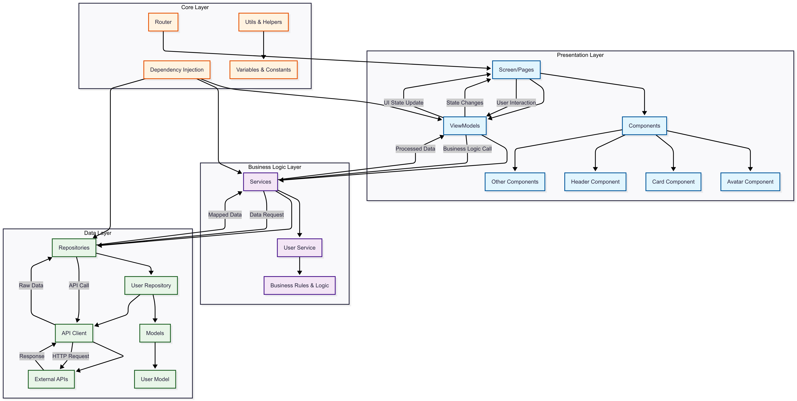

# Flutter Clean MVVM Architecture

A Flutter application built with Clean MVVM (Model-View-ViewModel) architecture pattern, emphasizing separation of concerns, testability, and maintainability.

## 📋 Table of Contents

- [Architecture Overview](#architecture-overview)
- [Project Structure](#project-structure)
- [Architecture Layers](#architecture-layers)
- [Data Flow](#data-flow)
- [Getting Started](#getting-started)
- [Code Examples](#code-examples)
- [Testing Strategy](#testing-strategy)
- [Contributing](#contributing)
- [Dependencies](#dependencies)

## 🏗️ Architecture Overview

This project implements a **Clean MVVM Architecture** with Repository Pattern and Dependency Injection, providing:

- **Separation of Concerns**: Clear boundaries between UI, business logic, and data layers
- **Testability**: Each layer can be unit tested independently
- **Maintainability**: Well-organized codebase that's easy to modify and extend
- **Scalability**: Architecture that supports feature growth
- **Reusability**: Components and services designed for reuse



## 📁 Project Structure

```
lib/
├── component/                 # Reusable UI Components
│   ├── avatars/
│   │   └── avatar.component.dart
│   ├── cards/
│   │   └── card.component.dart
│   ├── chips/
│   │   └── chip.component.dart
│   ├── header/
│   │   └── header.component.dart
│   ├── refresh/
│   │   └── refresh.component.dart
│   ├── shimmer/
│   │   └── shimmer.component.dart
│   └── states/
│       └── state.component.dart
├── core/                      # Core Infrastructure
│   ├── utils/
│   │   ├── provider.injection.dart
│   │   ├── router.dart
│   │   └── varguide.dart
│   └── apiclient.dart
├── data/                      # Data Layer
│   └── user/
│       ├── user.model.dart    # Data Models
│       ├── user.repo.dart     # Repository Implementation
│       ├── user.service.dart  # Business Logic Services
│       └── user.vmod.dart     # ViewModel
├── screen/                    # UI Screens/Pages
│   ├── user.screen.dart
│   └── userdetail.screen.dart
├── main.dart                  # Application Entry Point
└── .env                       # Environment Variables
```

## 🏛️ Architecture Layers

### 1. **Presentation Layer** (`screen/`, `component/`)
- **Screens**: Main UI pages that users interact with
- **Components**: Reusable UI widgets (avatars, cards, headers, etc.)
- **Responsibilities**: 
  - Display data to users
  - Handle user interactions
  - Manage UI state
  - Navigate between screens

### 2. **ViewModel Layer** (`*.vmod.dart`)
- **Purpose**: Bridge between UI and business logic
- **Responsibilities**:
  - Manage UI state
  - Handle user input validation
  - Call appropriate services
  - Transform data for UI consumption
  - Manage loading states and error handling

### 3. **Business Logic Layer** (`*.service.dart`)
- **Purpose**: Contains application-specific business rules
- **Responsibilities**:
  - Implement business logic
  - Coordinate between different data sources
  - Apply business rules and validation
  - Transform domain data

### 4. **Data Layer** (`*.repo.dart`, `*.model.dart`)
- **Repository**: Abstract interface for data operations
- **Models**: Data structures and entities
- **Responsibilities**:
  - Abstract data source implementation
  - Handle data caching and persistence
  - Provide clean API for data operations

### 5. **Core Layer** (`core/`)
- **Infrastructure**: Common utilities and configurations
- **Components**:
  - **API Client**: HTTP client configuration
  - **Dependency Injection**: Service container setup
  - **Router**: Navigation management
  - **Utils**: Helper functions and constants

## 🔄 Data Flow

1. **User Interaction** → Screen receives user input
2. **Screen** → Calls ViewModel methods
3. **ViewModel** → Invokes Service for business logic
4. **Service** → Requests data from Repository
5. **Repository** → Uses API Client for external calls
6. **Data Returns** → API → Repository → Service → ViewModel → Screen
7. **UI Update** → Screen reflects new state to user

## 🚀 Getting Started

### Prerequisites

- Flutter SDK (>=3.0.0)
- Dart SDK (>=2.19.0)
- IDE (VS Code, Android Studio, or IntelliJ)

### Installation

1. **Clone the repository**
   ```bash
   git clone <repository-url>
   cd flutter-clean-mvvm
   ```

2. **Install dependencies**
   ```bash
   flutter pub get
   ```

3. **Configure environment**
   ```bash
   cp .env.example .env
   # Edit .env with your configuration
   ```

4. **Run the application**
   ```bash
   flutter run
   ```

## 💻 Code Examples

### Model Example
```dart
// user.model.dart
class UserModel {
  final String id;
  final String name;
  final String email;
  
  UserModel({
    required this.id,
    required this.name,
    required this.email,
  });
  
  factory UserModel.fromJson(Map<String, dynamic> json) {
    return UserModel(
      id: json['id'],
      name: json['name'],
      email: json['email'],
    );
  }
}
```

### Repository Example
```dart
// user.repo.dart
abstract class UserRepository {
  Future<List<UserModel>> getUsers();
  Future<UserModel> getUserById(String id);
  Future<UserModel> createUser(UserModel user);
}

class UserRepositoryImpl implements UserRepository {
  final ApiClient _apiClient;
  
  UserRepositoryImpl(this._apiClient);
  
  @override
  Future<List<UserModel>> getUsers() async {
    final response = await _apiClient.get('/users');
    return (response.data as List)
        .map((json) => UserModel.fromJson(json))
        .toList();
  }
}
```

### Service Example
```dart
// user.service.dart
class UserService {
  final UserRepository _userRepository;
  
  UserService(this._userRepository);
  
  Future<List<UserModel>> getActiveUsers() async {
    final users = await _userRepository.getUsers();
    return users.where((user) => user.isActive).toList();
  }
}
```

### ViewModel Example
```dart
// user.vmod.dart
class UserViewModel extends ChangeNotifier {
  final UserService _userService;
  
  List<UserModel> _users = [];
  bool _isLoading = false;
  String? _error;
  
  List<UserModel> get users => _users;
  bool get isLoading => _isLoading;
  String? get error => _error;
  
  UserViewModel(this._userService);
  
  Future<void> loadUsers() async {
    _isLoading = true;
    _error = null;
    notifyListeners();
    
    try {
      _users = await _userService.getActiveUsers();
    } catch (e) {
      _error = e.toString();
    } finally {
      _isLoading = false;
      notifyListeners();
    }
  }
}
```

## 🧪 Testing Strategy

### Unit Tests
- **Models**: Test data serialization/deserialization
- **Services**: Test business logic implementation
- **Repositories**: Test data access logic
- **ViewModels**: Test state management and user interactions

### Integration Tests
- Test complete data flow from API to UI
- Test navigation between screens
- Test error handling scenarios

### Widget Tests
- Test individual components
- Test screen layouts and interactions
- Test state updates in UI

### Example Test
```dart
// test/user_service_test.dart
void main() {
  group('UserService', () {
    late UserService userService;
    late MockUserRepository mockRepository;
    
    setUp(() {
      mockRepository = MockUserRepository();
      userService = UserService(mockRepository);
    });
    
    test('should return active users only', () async {
      // Arrange
      final users = [
        UserModel(id: '1', name: 'John', isActive: true),
        UserModel(id: '2', name: 'Jane', isActive: false),
      ];
      when(mockRepository.getUsers()).thenAnswer((_) async => users);
      
      // Act
      final result = await userService.getActiveUsers();
      
      // Assert
      expect(result.length, 1);
      expect(result.first.name, 'John');
    });
  });
}
```

## 🤝 Contributing

1. Fork the repository
2. Create a feature branch (`git checkout -b feature/amazing-feature`)
3. Commit your changes (`git commit -m 'Add some amazing feature'`)
4. Push to the branch (`git push origin feature/amazing-feature`)
5. Open a Pull Request

### Coding Standards
- Follow Dart/Flutter conventions
- Write meaningful commit messages
- Add tests for new features
- Update documentation as needed
- Use meaningful variable and function names

## 📦 Dependencies

### Core Dependencies
```yaml
dependencies:
  flutter:
    sdk: flutter
  provider: ^6.0.5          # State management
  dio: ^5.3.2               # HTTP client
  get_it: ^7.6.4            # Dependency injection
  go_router: ^12.1.1        # Navigation
  flutter_dotenv: ^5.1.0    # Environment variables
```

### Development Dependencies
```yaml
dev_dependencies:
  flutter_test:
    sdk: flutter
  mockito: ^5.4.2           # Mocking for tests
  build_runner: ^2.4.7      # Code generation
  json_annotation: ^4.8.1   # JSON serialization
```

## 📝 License

This project is licensed under the MIT License - see the [LICENSE](LICENSE) file for details.

## 📞 Support

If you have any questions or need help with this architecture, please:

1. Check the [documentation](docs/)
2. Search existing [issues](issues/)
3. Create a new [issue](issues/new) if needed

---

**Happy Coding!** 🚀